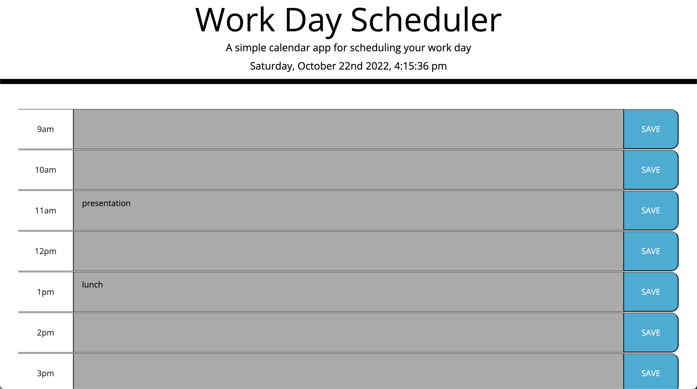

# 05 Third-Party APIs: Work Day Scheduler

This is a day planner that saves user input to local storage so that next time you load this site, you can see what you have scheduled for future reference. The planner shows the time for a regular work day, from 9am - 5pm. In the jumbotron, there is a live clock updating the time every second. It also shows the present date. This was done utilizing the Moment.js CDN. 

The planner also keeps track of what time it is during the day. It has color coded the time blocks accordingly: 
past - grey;   
present - green;   
future - red.   

## Preview of Site

Deployed URL: https://dustinlee0.github.io/Day-Planner/
Repository URL: https://github.com/DustinLee0/Day-Planner 

## Languages/Libraries Used

- HTML  
- CSS (Bootstrap v5.2.2)  
- Javascript  
    - jQuery.js v3.2.1  
    - Moment.js v2.29.4  

## User Story

AS AN employee with a busy schedule  
I WANT to add important events to a daily planner  
SO THAT I can manage my time effectively  

## Acceptance Criteria

GIVEN I am using a daily planner to create a schedule  
WHEN I open the   
THEN the current day is displayed at the top of the calendar  
WHEN I scroll down  
THEN I am presented with timeblocks for standard business hours  
WHEN I view the timeblocks for that day  
THEN each timeblock is color coded to indicate whether it is in the past, present, or future
WHEN I click into a timeblock  
THEN I can enter an event  
WHEN I click the save button for that timeblock  
THEN the text for that event is saved in local storage  
WHEN I refresh the page  
THEN the saved events persist  